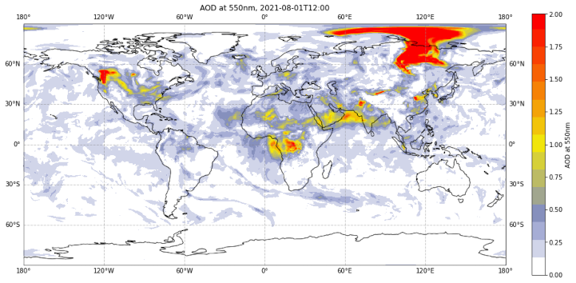

<br>

# Copernicus Atmosphere Monitoring Service (CAMS) Data Tutorials

**_Discover how to access and handle atmospheric composition data!_**

This website contains Jupyter notebook based tutorials that demonstrate how to access, process and visualise the wide variety of data provided by the [Atmosphere Data Store (CDS)](https://ads.atmosphere.copernicus.eu/) of the [Copernicus Atmosphere Monitoring Service (CAMS)](https://atmosphere.copernicus.eu/). Each tutorial includes code in Python and content in Markdown to provide clear, engaging and practical instructions on data handling which can be run in various cloud environments without any need for installation. You are invited to experiment with these tutorials and tailor them to your needs to extract results meaningful to you! The tutorials make use of data freely available on the ADS.

|                                               |                                      |
| :-------------------------------------------: | :----------------------------------: |
|  |  |

## Contents

Please browse through the tutorials listed below, or make use of the search function to look for specific topics or data processing workflows of interest.

```{tableofcontents}

```
